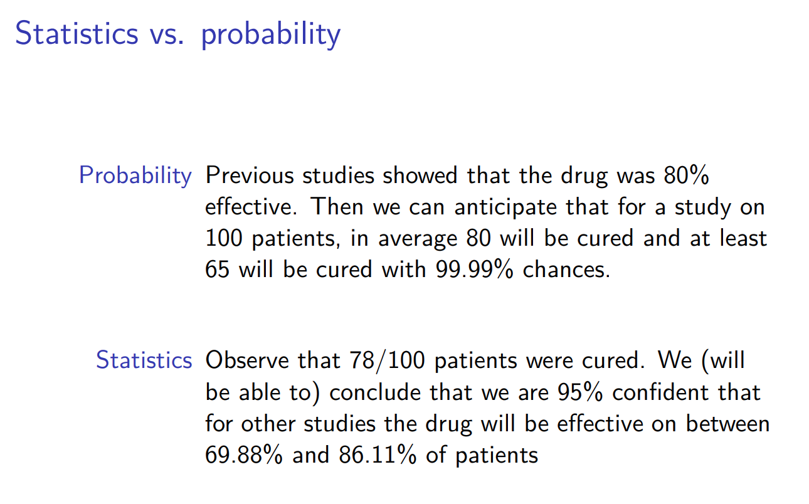
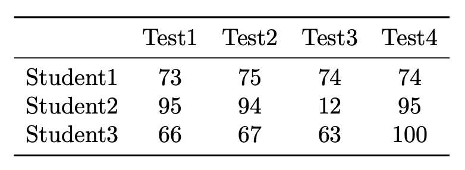
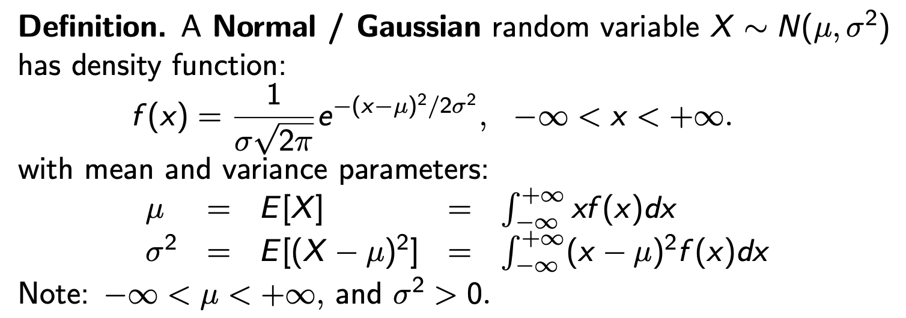
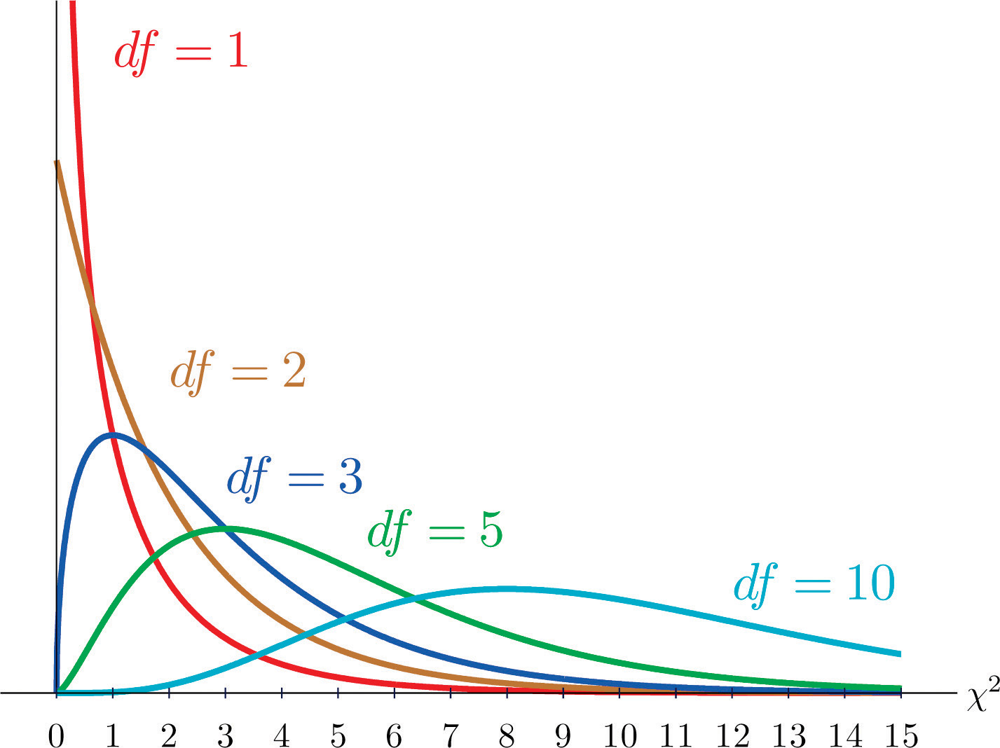
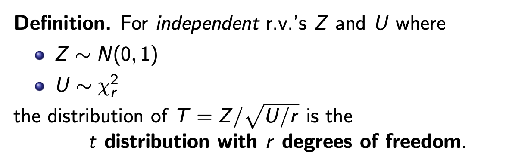
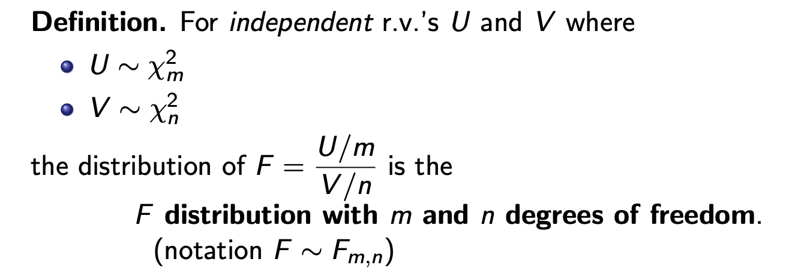
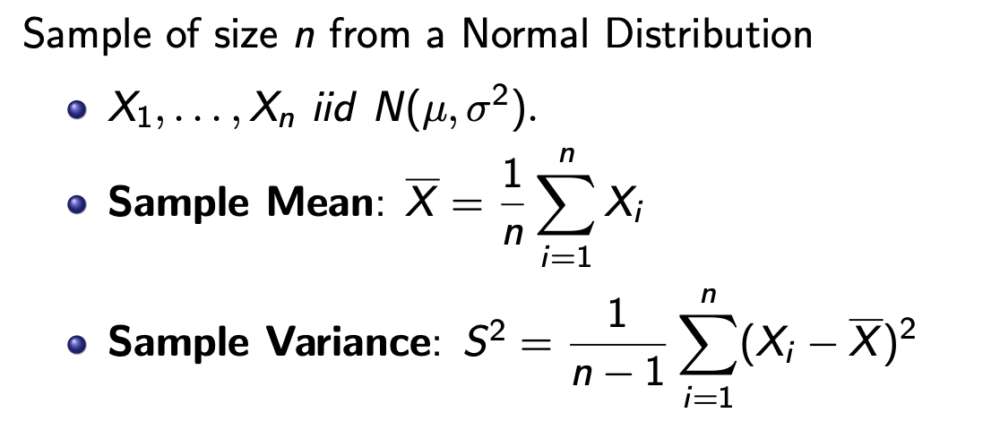
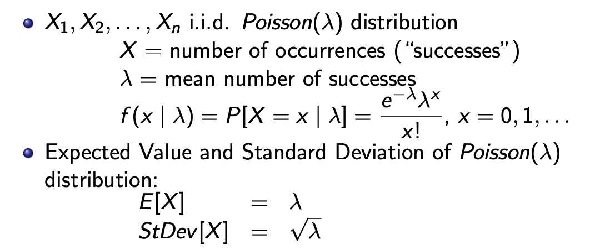
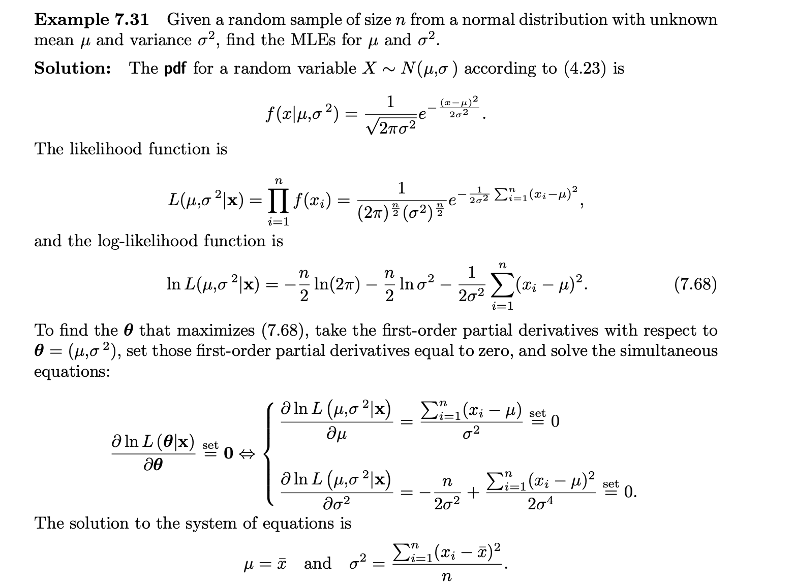
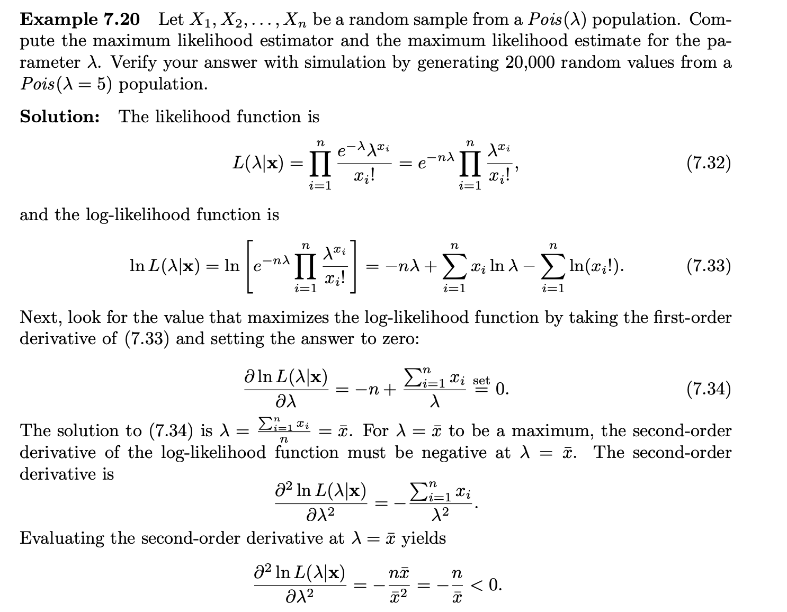

```{r include=FALSE}
library(PASWR2)
```



Chúng ta có thể sử dụng R base hoặc thư viện `tidyverse` để xử lý dữ liệu trong R.  
Các ví dụ ở dưới sẽ cố gắng sử dụng cả 2 cách.

```{r}
library(tidyverse)
```

```{r}
# Remove scientific notation
options(scipen=999)
```

# Basic

## cbind, rbind, apply
Giả sử ta có một bảng như thế này


Có thể nhập dữ liệu theo dòng

```{r}
stu1 <- c(73, 75, 74, 74)
stu2 <- c(95, 94, 12, 95)
stu3 <- c(66, 67, 63, 100)

# Sau khi nhập theo dòng, gộp các dòng này thành 1 dataframe
stu <- rbind(stu1, stu2, stu3) # rbind means combine rows
colnames(stu) <- c("Test1", "Test2", "Test3", "Test4") # rename column name
stu
```

Có thể apply 1 function nào đó vào từng dòng/cột của dataframe

```{r}
# Apply function mean, to each row of stu matrix.
means <- apply(stu, 1, mean) # 1 means row, 2 means column
medians <- apply(stu, 1, median)
stu <- cbind(stu, means, medians) # merge means and medians to original dataframe with cbind
stu
```

## quantile

```{r}
x <- c(1, 4, 7, 9, 10, 14, 15, 16, 20, 21)
# Caluculate quantile 25%, 50% and 75% of vector
quantile(x, probs=c(0.25, 0.5, 0.75))
```

## mean, variance

```{r}
mean(x) # mean
var(x) # variance (n-1)
sd(x) # standard deviation (n-1)
summary(x)
```

## correlation

Tìm correlation coefficient của 2 biến định lượng

```{r}
# Using mtcars package to get data mtcars
head(mtcars, 5)
```

```{r}
# We check the relation between mpg and wt variables
mtcars %>%
  ggplot(aes(x = mpg, y = wt)) +
  geom_point()
```

Now, run `cov` to check if there is correlation between 2 variables

```{r}
cor(mtcars$mpg, mtcars$wt)
```

This indicates a negative linear relationship between the two variables. 

## Counting

Tổ hợp chập 3 của 5: chọn 3 phần tử trong 5 phần tử. Không quan tâm thứ tự

```{r}
choose(5, 3)
```

## Sequence

Tạo ra 1 chuỗi từ 1 đến 100, với khoảng cách 4

```{r}
seq(1, 100, 4)
c(1:100) # khoảng cách 2 phần tử là 1
```

## Set seed

```{r}
# truyền vào 1 giá trị số bất kỳ, để xác định seed mình muốn tạo. Ví dụ ở đây là seed 1
set.seed(1)
# Ngay sau khi gọi set.seed thì gọi sample để tạo random sample cho seed 1 này
sample(LETTERS, 5)
```

Bây giờ ta có thể mở rộng seed 1, bằng việc tạo sample với nhiều giá trị hơn

```{r}
set.seed(1)
sample(LETTERS, 7)
```

Dễ thấy, 5 giá trị đầu tiên của sample vẫn không thay đổi, nó chỉ bổ sung thêm 2 giá trị ngẫu nhiên vào seed này. Đây chính là ý nghĩa của việc dùng seed - đảm bảo khả năng reproduced của sample.

Bây giờ ta thử tạo 1 cái seed 2 với tập mẫu khác
```{r}
set.seed(2)
sample(LETTERS, 7)
```

# Sampling

## Simple Random sampling

Lấy ngẫu nhiên n phần tử trong tập N. Xác suất để lấy mỗi phần tử là như nhau.
Việc lấy mẫu ngẫu nhiên như này chỉ phù hợp nếu tổng thể có tính đồng nhất (homogeneous) vì khi đó 1 mẫu ngẫu nhiên mới có thể đại diện được cho tổng thể (phản ánh được 1 số thuộc tính của tổng thể).

## Stratified Sampling

Chọn mẫu phân tổ là phương pháp lấy mẫu trong trường hợp tổng thể không đồng nhất. Cơ bản thì nếu tổng thể có thể chia nhỏ thành những tổng thể con, thì ta có thể sử dụng cách lấy mẫu này.  
Ví dụ một số nhân tố có thể giúp chia nhóm mẫu là giới tính, khu vực địa lý, ...

## Systematic Sampling

Trường hợp ta biết tổng thể, và muốn tiết kiệm chi phí (tài nguyên) ta cần chọn mẫu từ tổng thể đó 1 cách có hệ thống (có quy luật).

Ví dụ tổng thể 100 phần tử, lấy mẫu 10 phần tử. Thì quy luật là trong 10 phần tử đầu tiên, random 1 cái. Sau đó cứ cộng 10. Ví dụ random 7, thì sẽ lấy mẫu 7, 17, 27, ..., 97

## Cluster Sampling

Toàn bộ tập quần thể sẽ được chia thành từ cụm hoặc thành từng phần. Sau đó chúng ta sẽ chọn ngẫu nhiên từng cụm. Tất cả các cá thể trong cụm đó sẽ được sử dụng làm tập mẫu.

The main difference between cluster sampling and stratified sampling is that in cluster sampling, the cluster is treated as the sampling unit and analysis is done on a population of clusters

# Exploring Data

## Frequency table

Dữ liệu ví dụ: data về vé phạt tại Philadelphia.

```{r}
tickets <- read_csv("https://raw.githubusercontent.com/rfordatascience/tidytuesday/master/data/2019/2019-12-03/tickets.csv")
```

```{r}
summary(tickets)
```

Ta sẽ phân tích một số cột nhất đinh, là violation_desc, issue_datetime, fine và issuing_agency

```{r}
tickets <- tickets %>%
  select(violation_desc, issue_datetime, fine, issuing_agency)
```

```{r}
tickets %>%
  head(5)
```

Đầu tiên hãy bắt đầu với câu hỏi, những lý do vi phạm violation_desc là những lý do gì và tần suất các lý do. Cái nào phổ biến nhất, ít phổ biến nhất.

```{r}
# R base | %>% is from tidyverse, we use it here just to display the result
xtabs(~tickets$violation_desc) %>% 
  head(5)

# tidyverse
tickets %>%
  group_by(violation_desc) %>%
  count() %>%
  head(5)
```

Để biết tỷ trọng của từng loại vi phạm (chiếm bao nhiêu % trong tổng số vi phạm) thì sử dụng `prop.table`

```{r}
# R base
prop.table(
  xtabs(~tickets$violation_desc)
) %>%
  `*`(100) %>% 
  round(2) %>%
  head(5)

# tidyverse
tickets %>%
  group_by(violation_desc) %>%
  summarise(freq = n()) %>%
  mutate(prop = round(freq / sum(freq) * 100, 4)) %>%
  # chỉ lấy tỷ lệ lớn hơn 1%
  filter(prop > 1)
```

Vẽ đồ thị - Bar plot
```{r}
# R base | not recommend for plotting
prop.table(
  xtabs(~tickets$violation_desc)
) %>%
  `*`(100) %>% 
  round(2) %>%
  barplot()

# tidyverse
tickets %>%
  group_by(violation_desc) %>%
  summarise(freq = n()) %>%
  mutate(prop = round(freq / sum(freq) * 100, 4)) %>%
  # chỉ lấy tỷ lệ lớn hơn 1%
  filter(prop > 1) %>%
  ggplot(aes(x = reorder(violation_desc, freq), y = freq)) +
    geom_bar(stat="identity") +
    coord_flip()
```

##  Frequency table with 2 category variables

Vẫn sử dụng data vilation ở trên
```{r}
xtabs(~tickets$violation_desc + tickets$issuing_agency) %>% 
  head(5)
```

# Distribution

## Binom Distribution

Phân bố binomial thường được dùng để mô tả những biến ngẫu nhiên nhị phân (xảy ra vs không xảy ra)

Nếu ta thực hiện n phép thử nhị phân, với xác suất xảy ra True là p. Thì số lần xảy ra True kỳ vọng là $np

```{r}
# Ví dụ sample có n = 20 phép thử, pi là 0.5 là xác suất để sự kiện xảy ra.
# Thực hiện 10000 lần cái sample n kia và tính xác suất
bino.gen(samples = 10000, n = 20, pi = 0.5)
```

Có thể thấy, nếu thực hiện rất nhiều sample, thì phân bố binomial sẽ tiệm cận normal với giá trị kỳ vọng là $np$

## Poisson Distribution

Phân phối Poisson thường được dùng để mô tả những biến ngẫu nhiên rời rạc, dạng biến đếm.

Ví dụ tần suất 1 sự kiện xảy ra trong 1 khoảng thời gian.

- Số lượng xe ô tô đi qua 1 điểm trong khoảng thời gian xác định (ví dụ 30s)

- Số lượng khách hàng vào cửa hàng trong 1 khoảng thời gian xác định (ví dụ từ 9h đến 10h sáng)

Như vậy, biến ngẫu nhiên X phân phối Poisson với tham số $\lambda$, ở đây $\lambda$ là giá trị trung bình.

$$
X \sim {\sf Poisson}(\lambda)
$$

Ví dụ, biến ngẫu nhiên X, có phân phối Poisson và $\lambda$ là 3, tức là giá trị trung bình của nó là 3.

Vẽ biểu đồ ra, thì điểm cao nhất của phân bố sẽ xoay quanh 3
```{r}
hist(rpois(100000, 5), breaks = 15, col = 'orange2')
```

Có thể tính CDF, $P(X < \alpha)$ bằng cách 

```{r}
# Với lambda là 5, muốn tính xác suất X nhỏ hơn 8 ta dùng
ppois(8, 5)
```


## Normal distribution



## Chi-Square Distributions

Khi ta có một biến ngẫu nhiên có phân bố chuẩn tắc là Z với $\mu = 0$ và $\sigma = 1$, khi đó bình phương của Z sẽ có phân bố chi-square


Nếu chỉ có 1 biến là $Z^2$ thì phân bố Chi-Squared sẽ có 1 bậc tự do.



Nếu có tổng nhiều $Z^2$ thì số bậc tự do cũng tăng lên (bằng số biến $Z^2$)


## Student's t Distributions

Kết hợp 1 biến phân bố chuẩn tắc, và 1 biến phân bố Chi-squared ta được 1 biến phân bố student như sau



## F Distributions

2 biến phân bố Chi-squared sẽ có tỷ lệ là 1 phân bố F.



# Statistics from sample - Đặc trưng / tham số của mẫu

## Đặc trưng từ mẫu phân phối chuẩn

Lấy mẫu ngẫu nhiên $n$ phần tử trong tổng thể có phân phối Chuẩn.

Mỗi **quan sát** trong mẫu này là 1 biến ngẫu nhiên $X_i$ có phân phối Chuẩn với trung bình là $\mu$ và phương sai $\sigma^2$



## Đặc trưng từ mẫu phân phối Poisson



# Point estimation

Ước lượng điểm. Ví dụ với 1 biến ngẫu nhiên phân phối chuẩn với tham số $\mu$ và $\sigma$, ta lấy mẫu ngẫu nhiên, và từ mẫu ngẫu nhiên N phần tử này ta cố gắng ước lượng 2 tham số ở trên.

Có thể đơn giản là lấy kỳ vọng mẫu làm ước lượng cho $\mu$ tổng thể và phương sai mẫu làm ước lượng cho $\sigma$ tổng thể.

Giả định, ta có 1 ước lượng điểm $T$ của 1 parameter $\theta$

## Các tính chất của Point estimation

### Mean Square Error

Với 1 phương pháp lấy ước lượng điểm, thực hiện trên nhiều sample thì ta có các ước lượng $T_1$, $T_2$, $T_3$, ...

Đây là 1 chỉ số để đánh giá độ chuẩn xác của 1 ước lượng điểm. Nó là bình phương của sai số giữa $T$ và $\theta$ và sau đó thì tính mean.

$$
\begin{aligned}
MSE[T] &= E[(T - \theta)^2] \\
       &= Var[T] + (E[T] - \theta)^2 \\
       &= Var[T] + (Bias(T))^2
\end{aligned}
$$
MSE càng nhỏ thì ước lượng càng chính xác.

#### Unbiased Estimators

Có thể thấy 1 trong 2 thành phần của **MSE** là **Bias của T** chính là hiệu của $E[T]$ và $\theta$

Unbiased Estimators là estimator **T** mà $E[T] = \theta$

Sample mean $\overline{X}$ và sample variance $S^2$ là unbiased estimators của population mean và population variance

### Efficiency

Một estimator tốt là 1 estimator có MSE nhỏ, và Efficiency cũng là 1 cách để nói về MSE nhỏ

$$
eff[T] = \frac{1}{MSE[T]}
$$

### Consistency

Với các sample size khác nhau, ta có thể tạo ra các estimator khác nhau. Ví dụ, biến ngẫu nhiên $N(\mu, \sigma)$ lấy sample N = 1.

Khi đó, ước lượng $T_1$ được tính từ sample 1 phần tử trên.

Thêm 1 quan sát vào sample trên, ta có sample 2 phần tử, từ đó tính được $T_2$, tương tự thế, tăng số lượng quan sát, ta có các $T_n$ ước lượng, đối với sample có n phần tử/quan sát.

Ước lượng là consistent nếu n càng tăng, thì ước lượng $T$ càng tiến đến/hội tụ về giá trị thực sự $\theta$

### Robustness

Một chỉ số phản ánh mức độ phụ thuộc của estimator vào phân phối của tổng thể.

Nói cách khác, trường hợp mà ta không biết tổng thể có phân phối gì, thì việc estimate sẽ khó và thiếu chính xác hơn. Nên là 1 estimate mà càng ít phụ thuộc vào loại phân phối của tổng thể thì càng tốt, càng Robust.

Mở rộng, thì ngoài phân phối, các giả thiết khác như tính độc lập, ... cũng được xét đến trong Robustness

## Cách xác định Point estimator

Có 2 phương pháp chính dùng để tính ước lượng điểm.

- Method of moments: Dựa vào hàm tạo moment (Moment generate function) của phân phối.
- MLE: Maximum likelyhood estimate

Dựa vào Method of moments mà ta xác định được 1 estimator của population mean là sample mean. (vì sample mean là 1st moment)

Ví dụ về MLE:




## Fisher Information

Thông tin Fisher - sẽ tìm hiểu thêm sau khi cần thiết.

# Confidence Interval

> Khoảng tin cậy (CI) quan trọng ở cách tính. 

> Với **1 cách tính khoảng tin cậy 95% xác định**, với **1 sample X xác định** thì ta tính được khoảng tin cậy $L_x$ đến $U_x$; có nghĩa là nếu ta lấy thêm 100 samples nữa, Y, Z, K, ... thì 95 samples trong số đó, khi áp dụng cách tính khoảng tin cậy trên, ra được các khoảng $L_y, U_y$; $L_k, U_k$ chứa true parameter.

## Test liệu có phải phân phối normal

Có thể dùng `qqline` function để test xem mẫu có phân phối chuẩn không.

Nếu plot càng gần với đường chéo thì càng chứng tỏ là normal

```{r}
qqnorm(rnorm(n=50))
qqline(rnorm(n=50))
```


## CI for Population Means

### Sampling từ **phân phối chuẩn** và **biết $\sigma^2$ của tổng thể**

$$
\left[ 
\overline{x} - z_{1 - \alpha/2}\frac{\sigma}{\sqrt{n}}, \;
\overline{x} + z_{1 - \alpha/2}\frac{\sigma}{\sqrt{n}}
\right]
$$
Có thể vẽ CI đối với trường hợp trên như sau,

```{r}
set.seed(10)
cisim(samples = 100, n = 100, parameter = 0.5, type = "Mean", sigma = 1, conf.level = 0.95)
```

Trong đó, $z_1-\alpha/2$ có thể được tính bằng
```{r}
# với alpha là 5% thì giá trị z là
qnorm(1 - 0.05/2)
```

Để tính CI, có thể áp dụng công thức trên, hoặc dùng z.test

```{r}
z.test(
  x = c(100, 120, 130, 140, 150, 145, 134, 123, 156, 172), # Data từ sample
  sigma.x = 3, # sigma của tổng thể
  n.x = 10, # size của sample
  conf.level = .95 # độ tin cậy 95%
)
```

### Sampling từ **phân phối chuẩn** và **không biết $\sigma^2$ của tổng thể**

Thay vì sử dụng $\sigma$ tổng thể, ta dùng $s$ là sample standard deviation

$$
\left[ 
\overline{x} - t_{1 - \alpha/2;n-1}\frac{s}{\sqrt{n}}, \;
\overline{x} + t_{1 - \alpha/2;n-1}\frac{s}{\sqrt{n}}
\right]
$$


